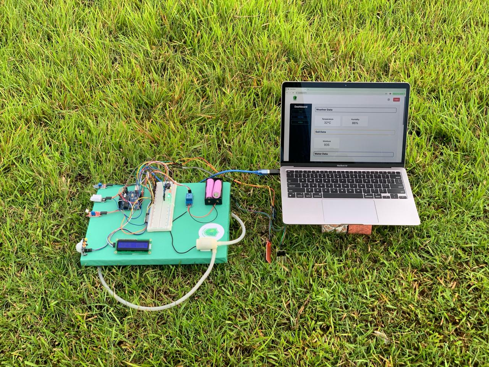
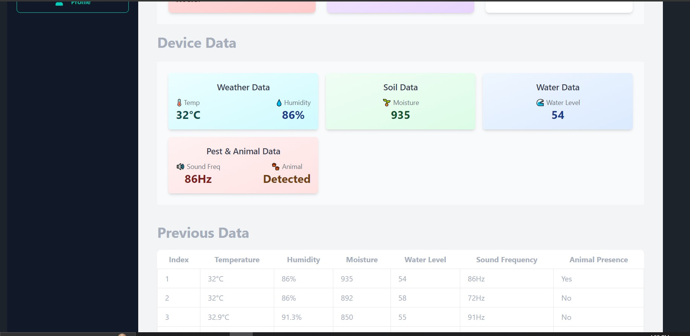
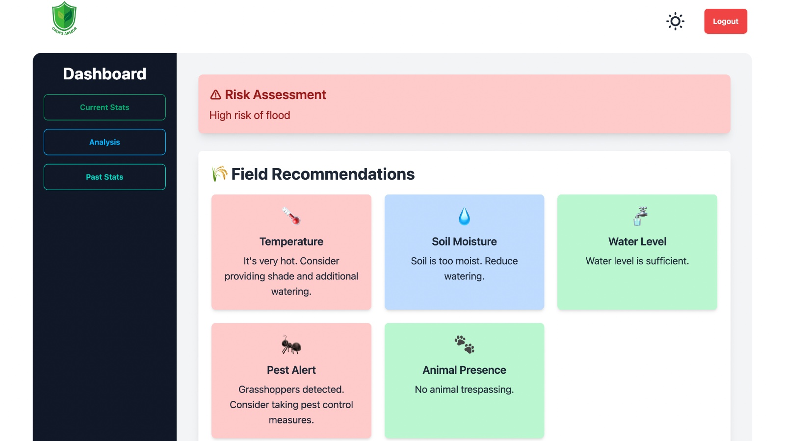
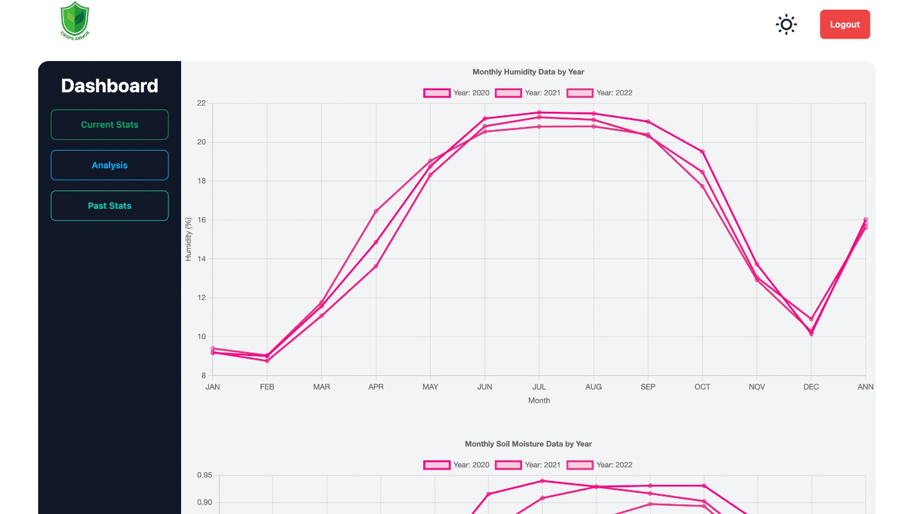

# Crops Armor - Informed Agricultural Decision-Making Tool

## Overview

Crops Armor is an innovative tool designed to empower farmers with accurate, real-time insights into environmental conditions. By leveraging both NASA datasets and real-time sensor data, Crops Armor helps farmers make informed decisions to optimize crop yields, manage water resources effectively, and mitigate risks related to floods and droughts.

## Features

- **Real-time Data Monitoring:** Collects and displays data from sensors, including temperature, humidity, soil moisture, water level, and more.
- **NASA Data Integration:** Utilizes NASA datasets for historical analysis and trend prediction.
- **Insight Generation:** Provides insights on humidity, precipitation, soil moisture, temperature, and wind trends.
- **Risk Assessment:** Predicts the risk of flood or drought based on environmental data.
- **User-Friendly Interface:** Easy-to-use web app for monitoring and analysis.

## Screenshots

### 1. IoT Device Data Overview

### 2. Login Page

### 3. Current Statistics

### 4. Data Analysis

### 5. Historical Data

## Web Application Overview

The Crops Armor web application provides an intuitive interface for farmers to monitor their environmental conditions and receive predictive insights. Below are some key features displayed through screenshots:

1. **IoT Device Dashboard:** The dashboard provides real-time data collected from various environmental sensors.

2. **Login Screen:** A secure login screen ensures that only authorized users can access the dashboard.

3. **Current Statistics:** Displays the current readings of temperature, humidity, soil moisture, and water levels.

4. **Data Analysis:** Insightful data analysis combining real-time and historical data to predict potential environmental risks like floods and droughts.

5. **Historical Data:** A detailed view of historical data trends for deeper insights into environmental conditions.

## How It Works

1. **Data Collection:** Environmental data is collected via sensors and stored in MongoDB.
2. **Data Analysis:** The backend processes this data using machine learning to compare real-time data with NASA's historical datasets.
3. **Prediction & Insights:** Based on the analysis, the system provides insights into current conditions and predicts potential risks like floods or droughts.
4. **Web Interface:** Farmers can access all this information through a user-friendly web application.

## Technologies Used

- **Backend:** Node.js, Express.js, MongoDB, Mongoose
- **Frontend:** HTML, CSS, JavaScript
- **Machine Learning:** Implemented through custom algorithms to analyze and predict environmental trends.

## License

This project is licensed under the MIT License - see the [LICENSE](LICENSE) file for details.
