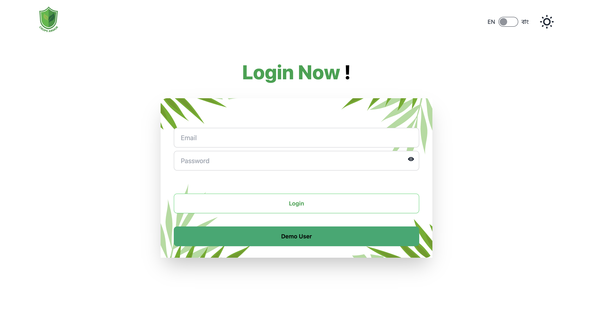
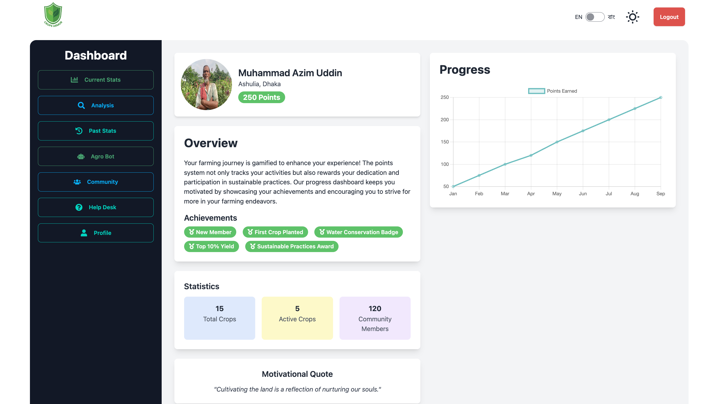
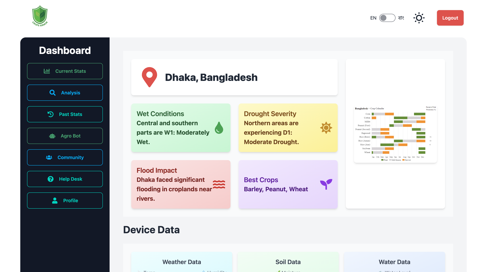
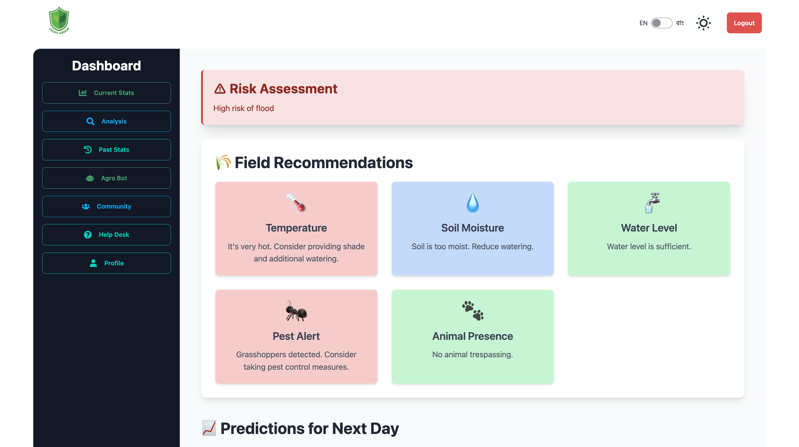
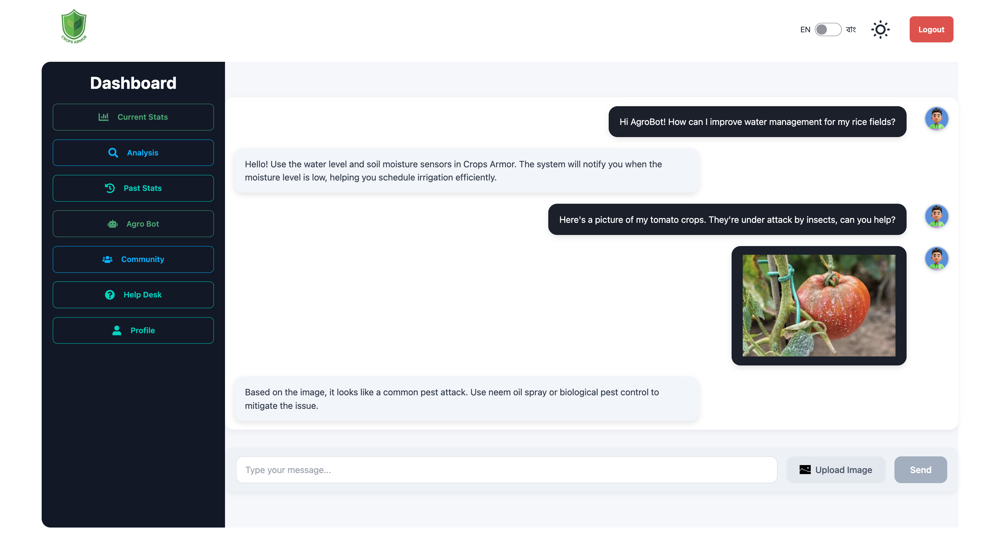
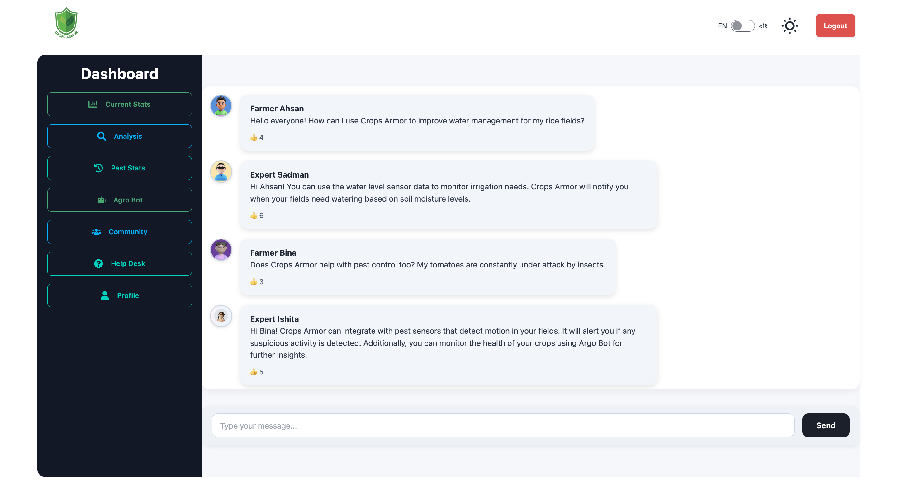
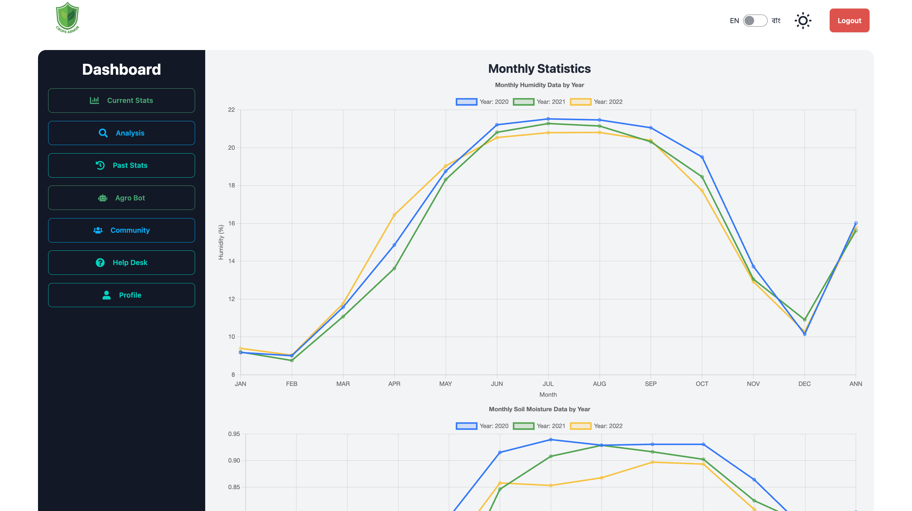
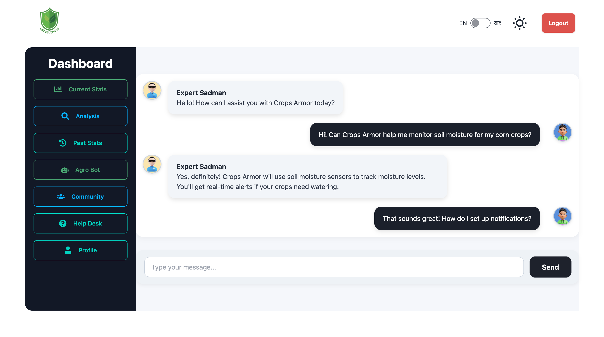

# Crops Armor - Empowering Farmers with Data-Driven Decisions 🌾🌍

## Overview

Crops Armor is a next-generation solution designed to revolutionize farming by providing farmers with real-time insights, predictive analytics, and risk assessments. By seamlessly integrating **NASA's Earth observation datasets** and **IoT sensor data**, Crops Armor empowers farmers to make informed decisions, optimize crop yields, and mitigate the impacts of unpredictable environmental changes such as floods, droughts, and soil health issues.

Our platform not only offers precise insights but also bridges the gap between technology and agriculture by equipping farmers with tools they can trust.

## Key Features 🚀

- **🌐 Real-time Data Monitoring:** IoT sensors collect data on temperature, humidity, soil moisture, water levels, and more—accessible in a user-friendly web app.
- **🛰️ NASA Data Integration:** Historic data combined with real-time information to generate precise, actionable insights.
- **🤖 Agro Bot (AI Chatbot):** Provides farmers with crop guidance, risk alerts, and community support.
- **📈 Predictive Analytics:** Advanced machine learning algorithms analyze trends, helping farmers anticipate droughts, floods, or pest threats.
- **🚰 Automated Water Pump:** Ensures optimal irrigation by activating when soil moisture falls below ideal levels.
- **🌎 Multi-Language Support:** Available in both **Bangla** and **English**, making it accessible to a broader audience of farmers.
- **🎮 Gamified Experience:** Track progress with points and rewards to keep farmers engaged.
- **👥 Community Support:** Farmers can connect, share experiences, and ask questions through our integrated community forum.

## Screenshots 🌟

### 1. IoT Device Dashboard - Real-time Data Overview

### 2. Login Screen (Bangla and English)

### 3. User Profile

### 4. Dashboard - Bangla & English

### 5. Current Crop Statistics

### 6. Data Analysis & Insights

### 7. AI Chatbot - Agro Bot

### 8. Community Forum

### 9. Historical Data & Trends

### 10. Help Desk Support

## How Crops Armor Works ⚙️

1. **Data Collection:** IoT sensors gather environmental data, which is transmitted to a central server and stored in MongoDB.
2. **Data Analysis:** Machine learning models process real-time and historical data (from NASA) to predict trends and risks like droughts, floods, or pest outbreaks.
3. **Automated Decision-Making:** Farmers receive tailored recommendations such as irrigation schedules, crop suggestions, and risk alerts directly on their dashboard.
4. **AI Chatbot & Community:** Agro Bot offers real-time guidance, while the community forum enables farmers to connect and share insights.
5. **Web Interface:** All data is accessible via a user-friendly web app available in both **Bangla** and **English**, ensuring a seamless user experience.

## Technologies Used 💻

- **Backend:** Node.js, Express.js, MongoDB, Mongoose
- **Frontend:** React, Tailwind CSS
- **Machine Learning:** Custom algorithms powered by real-time and historical data to predict environmental conditions and offer risk assessments
- **IoT Integration:** Sensors monitor environmental factors, providing real-time data for analysis and action.

## The Future of Farming 🌱

Crops Armor envisions a world where farmers are empowered by data-driven insights, ensuring higher yields and more sustainable farming practices. With our platform, farmers can stay one step ahead of unpredictable weather and changing environmental conditions, leading to enhanced productivity and food security for future generations.

---

## License

This project is licensed under the MIT License - see the [LICENSE](LICENSE) file for details.
